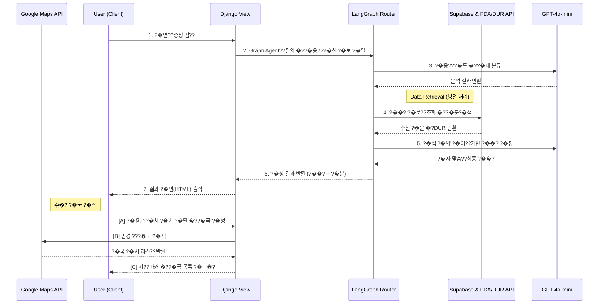

<div align="center">

# ?�� AI 증상 기반 ?�품 추천 ?�비??(SKN22-4th-1Team)

[](https://python.org)
[](https://www.djangoproject.com)
[](https://openai.com)
[](https://langchain.com)
[](https://supabase.com)

<br/>

**?�용?�의 증상???�해?�고 DUR(?�전주의) ?�보?� 맞춤???�품 �?주�? ?�국???�내?�는 ?�마???�료/?�국 AI 비서**

</div>

---

> [!CAUTION]
> **?�️ ?�료 면책 조항 (Medical Disclaimer)**
> 
> �??�스?��? **OpenFDA, 공공?�이?�포??KCD-9/DUR)** ?�이?��? 기반?�로 ?�보�??�공?�며, **?�학??진단?�나 처방???�?�할 ???�습?�다.**
> 
> - ?�� ?�공???�보???�시�?API 검??결과?�나, AI 가�?과정?�서 부?�확???�용???�출?????�습?�다.
> - ?�� **모든 건강 관??결정?� 반드???�사 ?�는 ?�사?� ?�담 ??진행?�세??**
> - ?�� 기�?질환, ?�신 ?��?, ?�레르기???�른 부?�용?� 개인???�라 ?�이?��?�?참고?�으로만 ?�용 바랍?�다.
> - ?�� �??�스???�용?�로 ?�한 ?�떠???�해???�?�서??책임지지 ?�습?�다.

---

## ?�� 목차

- [기술 ?�택](#-기술-?�택)
- [?�로?�트 구조](#-?�로?�트-구조)
- [?�스???�키?�처](#-?�스???�키?�처)
- [?�계�??�세 ?�명](#?�계�??�세-?�명)
- [?�동 ?�모](#-?�동-?�모)
- [?�러블슈??�?극복 ?��?](#-?�러블슈??�?극복-?��?)
- [?�후 로드�?(#-?�후-로드�?
- [?�행 방법](#-?�행-방법)
- [질문 ?�시](#-질문-?�시)
- [주요 ?�정](#-주요-?�정)
- [?�???�개](#-?�???�개)

---

## ?�� 기술 ?�택

| 분류 | 기술 | ?�명 |
|:---:|:---:|:---|
| ?���?**Backend & UI** | Django | MVT ?�키?�처 기반 ?�페?��? ?�터?�이??�??�비???�합 |
| ?�� **Orchestrator** | LangGraph | State Graph�??�용???�이?�트 ?�계 ?�어 (분류/검???�성) |
| ?�️ **Agent Core** | GPT-4o-mini | ?�도 분류 로직(Classifier) �?질의?�답 ?�답(Generator) |
| ?�️ **External API** | OpenFDA | 미국 FDA ?�품 ?�벨 �?가?�드?�인 DB 검???�동 |
| ?�� **Data & Auth** | Supabase (PostgreSQL) | ?��? ?�증 �??�로??DUR 관�??�이???�스 |
| ?�� **External API** | Google Maps API | ??주�? 반경 ???�국 �?병원 ?�인 |

---

## ?�� ?�로?�트 구조

```text
/Users/eom/???�라?�브/workspaces/SKN22-4th-1Team
?��??� ?? otc_info/               # Django 백엔??메인 ?�플리�??�션
??  ?��??� chat/                       # ??UI ?�공 기능 �?컨트롤러 모듈 (Views)
??  ?��??� drug/                       # DUR 검�? FDA 경고 ?�이??질의 ???�약????
??  ?��??� graph_agent/                # LangGraph ?�프??로직
??  ??  ?��??� builder_v2.py           # ?�드 매핑 �?그래??컴파??(Router)
??  ??  ?��??� nodes_v2.py             # �??�계???�업 ?�의 �??�행 (State 갱신)
??  ??  ?��??� state.py                # ?�이?�트 ?�태 ?�터?�이???�의
??  ?��??� prompts/                    # LLM ?�르?�나 �??�답 구성 ?�플�??�일
??  ?��??� scripts/                    # ?�틸리티 �??�스???�로?�일�??�크립트 모음
??  ?��??� services/                   # 주요 비즈?�스 �?API ?�동 로직
??  ??  ?��??� ai_service_v2.py        # LangChain LLM ?�신 ?�래??
??  ??  ?��??� map_service.py          # Google Map ?�동 �??�국 추천
??  ??  ?��??� drug_service.py         # DUR �??��? ?�버 ?�보 가�??�비??
??  ??  ?��??� user_service.py         # ?��? 메디�??�로???�레르기, 복약) 관�?
??  ?��??� otc_info/              # Django Main Settings �?URL Routing
??  ?��??� users/                      # ?�증 �??�로???�용 App
?��??� ?�� requirements.txt             # ?�키지 ?�존??
?��??� ?�� data_pipeline/               # KCD-9 �?DB 백업/복원 �??�이?�라???�기??
?��??� .env                            # ?�경 ?�정 (API Key ??
?��??� ?�� 04_test_plan_results/        # ?�스??관???�더
```

---

## ?�� ?�스???�키?�처

�??�로?�트??**LangGraph (Router+State Machine ?�턴)** 기반??RAG ?�스?�으�? ?��? ?�보(메디�??�로???� API 조회값을 결합???�전 ?�터�??�계�?강제?�니??

```mermaid
graph TD
    %% ?�용??�?진입??
    User["?�� ?�용??] -->|"질의 ?�는 ?�치 ?�보"| DjangoUrls["otc_info/urls.py"]
    DjangoUrls -->|"경로 지??| Views["chat/views.py"]

    subgraph Security_User ["?���?Authentication & Profile"]
        Views -.->|"메디�??�보 ?�득"| UserSvc["user_service.py"]
        UserSvc -->|"Read/Write"| Supabase[("?�️ Supabase (PostgreSQL)")]
    end

    subgraph LangGraph ["?�️ Graph Agent Layer (graph_agent/)"]
        Builder["builder_v2.py"]
        Nodes["nodes_v2.py"]
        State["state.py"]
        Prompts["prompts/"]
    end
    
    subgraph Services ["??Service & Logic Layer (services/)"]
        MapSvc["map_service.py"]
        AISvc["ai_service_v2.py"]
        DrugSvc["drug_service.py"]
    end

    %% Flow: AI ?�답 ?�이?�라??
    Views -->|"그래??체인 ?�작"| Builder
    Builder -->|"?�태 관�?| State
    State -->|"분기 ?�단"| Nodes
    Nodes -.->|"Prompts 참조"| Prompts

    %% Agent External calls (Data Retrieval & AI)
    Nodes -->|"검??추론 ?�청"| DrugSvc
    Nodes -->|"LLM ?�약/분류"| AISvc
    
    %% Flow: 비동�??�국 ?�색 ?�이?�라??
    Views -->|"비동�??�치 ?�색 (?�립 ?�행)"| MapSvc
    
    %% APIs
    DrugSvc -->|"HTTP"| ExtPine[("FDA / Public API")]
    DrugSvc -->|"HTTP"| ExtFDA[("?�� OpenFDA & DUR API")]
    MapSvc -->|"HTTP"| ExtMaps[("?���?Google Maps API")]


```

### ?�� 출력 ?�이?�라??(Data Pipeline Flow)

?�용?��? 증상(?? "머리가 ?�프�??�이 ?�요")??질의?�을 ?? ?�스?�이 ?�보�??�집?�고 ?��???출력???�까지??과정?�니??



### ?�� 주요 모듈 ?�세 ?�명

- **?�플리�??�션 계층 (`chat/views.py`)**: ?�용???�터?�이??메인 진입?? ?�용?�의 ?�력???�어?�면 ?�션?�서 ?�자 ?�보�?조회????LangGraph???��???진입?�으�??�깁?�다.
  
- **?�태 기계(Graph) 계층 (`graph_agent/`)**: LangGraph ?�레?�워?��? ?�해 ?�태 ?�이�??�의?�니??
  - `builder_v2.py`: 질문??카테고리(?�순 ?�품 검?? 증상 기반 ?�품 추천, ?�반 질의)??맞게 ?��?(Edge)?� ?�드�??�결.
  - `nodes_v2.py`: 카테고리??맞는 ?�세 검??FDA Vector 검?? 공공?�이??Open API 검?? ?�드�??�의?�니?? ?��???기�? 질환 ??메디�??�로?�과 추출???�분??결합?? 추천 ??DUR ?�반?�항 ?��?�?거치?�록 ?�전망을 구현?�습?�다.

- **보안 �??�증 (`users/` & `Supabase RLS`)**: ?�자 ?�명�?직결?????�는 '기록 ?�이??기�?질환, ?�레르기 ??'??보안 무결?�을 최우?�으�??�니??
  - ?�반?�인 백엔???�플리�??�션 계층 방어???�존?��? ?�고, ?�이?�베?�스 ?�진(PostgreSQL)??**RLS(Row Level Security, ???��? 보안)** ?�책???�용?�습?�다.
  - ?�용?�의 JWT ?�증 ?�큰(User ID)???�치?��? ?�는 경우, DB ?�진 ?�벨?�서 ?�초???�?�의 ?�료 ?�이?��? ?�거???????�도�??�천 차단?�는 가??견고??보안 격리 방식??구축?�습?�다.

---

## ?�계�??�세 ?�명

### Phase 1: Classifier (Router Node)
- **?�일**: [nodes_v2.py](/otc_info/graph_agent/nodes_v2.py)
- **??��**: 
    - ?�용?�의 질문 ?�용??`symptom_recommendation`, `product_request`, `general_medical` 카테고리 �??�나�?분류?�니??
    - ?�력 ?�류?�거??메디�?주제???�긋?�는 ?�력(Invalid)??경우 조기??방어?�니??

### Phase 2: User Context Integration
- **?�일**: [user_service.py](/otc_info/services/user_service.py)
- **??��**: 
    - ?�증???��??�면 복약 중인 ?�물, ?�레르기 ??��, ?�이 �??�신 ?��? ?�의 ?�용???�로???�스?��? ?�재 ?�태(State) ?�이?�에 ?�재?�니??

### Phase 3: Data Retrieval (API Search)
- **?�일**: [drug_service.py](/otc_info/services/drug_service.py)
- **??��**: 
    - 증상 ?�워???? 복통, ?�통)??OpenFDA API Search�??�용???�합???�능???�품 ?�분 목록??반환받습?�다.
    - 추출???�분 ?�보군을 ?�?�으�? **?��? ?�로?�과 ?��?*?�여 ?�평??DUR API??병용 금기 �??�령 주의?�보�?HTTP 쿼리�?가?�옵?�다.

### Phase 4: Generator & Action (Synthesis / Map)
- **?�일**: [prompts.py](/otc_info/prompts/answer_prompts_v2.py) & [map_service.py](/otc_info/services/map_service.py)
- **??��**: 
    - 취합???�전/경고 리포??DUR)?� ?�품???�분 ?�과�?조합?? GPT-4o-mini 모델�?**가???�전???�사결정 방식??최종 ?�국??마크?�운 ?��?**??만들???�니??
    - 최종 ?��????�성?�면 ?�용?�의 ?�재 ?�치�?기반?�로 구�? 지?��? ?�용??근교 ?�국???�각?�합?�다.

---

## Router(Graph) Pattern???�점
1.  **?�사결정???��???지??*: ?�순 검?��? 바로 Database?�서 꺼내?�고, 복잡??증상?� 추론 �??�터�??�드�??�러 �?거치????카테고리별로 비용 최적?��? 가?�합?�다.
2.  **?�전 ?�터 체인(Chain of Safety)**: RAG 모델 ?�각(Hallucination)??부?�용??막기 ?�해 모든 ?�국 추천 카테고리??DUR API 조회?�는 **?�수 ?�드**�?거치�??�계?? 모델 ?�의�?금기 ?�품??추천?�는 ?�상??100% 차단?�니??
3.  **명시???�러 ?�들�?*: ?�정 API ?�출???�패?�더?�도 ?�른 경로�??�백(Fallback)?????�는 구조??분기?�력??보유?�니??

---
---

## ?�� ?�동 ?�모

| ?�� ?�서비스 메인 ?�면 | ?���?반경 ???�국 검??|
|:---:|:---:|
|  |  |
| **?�연??증상 ?�력 ??추천 ?�품 ?�내** | **???�치 기반 반경 ???�국 ?�각??* |

---

## ?�� ?�러블슈??�?극복 ?��?

?�로?�트�?진행?�며 겪었??주요 기술??챌린지?� ?�결 과정?�니??

### 1. LangGraph Pipeline ?�각(Hallucination) ?�어
- **문제**: LLM 모델??증상 기반 ?�품 추천 ??가?�의 ?�품?�나, ?��???기�?질환??치명?�인 ?�품??추천?�는 ?�상 발생.
- **?�결**: Router ?�드?�서 `symptom_recommendation`??감�???경우, "DUR/OpenFDA 조회 ?�드"�?**강제 (Mandatory) ?�과**?�도�?State Machine ?��?�??�계?�습?�다. ?�집???�약 API 반환�?Context) ?�의 ?�물?� ?�롬?�트 ?�에??철�???차단?�는 `Chain of Safety` ?�키?�처�?구현???�뢰?��? ?��??�니??

### 2. ?��? ?�성 지??문제
- **문제**: 추천 ?�분???�러 개일 ???�평??병용 금기 API�??�중 ?�출?�며 ?�체 ?�답 ?�이?�라??지?�이 발생.
- **?�결**: `drug_service.py` ??API ?�출 구조�?**병렬 비동�??�출(Async gather)** 기반?�로 ?�면 리팩?�링?�습?�다. ?�시??처리 가?�한 ?�중 ?�분 쿼리?��? ?��??�간 ?�이 ??번에 ?�청 �?분석?�어, ?�체 ?�답 ?�이?�라??지???�간??기존 ?��??�기?�으�???��?�습?�다.

### 3. Django 비동�?ASGI) ?�경 ?�환???�한 ?�레??블로???�결
- **문제**: LangGraph 체인�??�단�?API(OpenFDA, Supabase, Google Maps)�??�출?�는 구조?�서, 기존 Django???�기??WSGI(`manage.py runserver`) ?�경???�용??경우 ?�레??블로??Thread Blocking)?�로 ?�해 ?��????�율??급감?�는 ?�상??발생?�습?�다.
- **?�결**: ?�플리�??�션 구동 방식??`Uvicorn` 기반??ASGI ?�경(`run_uvicorn.py`)?�로 ?�환?��??�니?? ?��? ?�해 �?`views.py`)부???�드(`nodes_v2.py`)까�? 모든 ?�이?�라?�을 `async/await` ?�이?�브 비동기로 ?�일?�켜 ?�많?� I/O 바운???�업??병목 ?�상???�공?�으�??�소?�습?�다.

### 4. ?�국?????? ?�료 ?�이??불일치로 ?�한 검???�확??개선
- **문제**: ?�용?�는 ?�국?�로 증상 구어�??? "머리가 ???�파??)�??�력?��?�? 기반 ?�이?�인 FDA 가?�드?�인�??�스???�이?�는 ?�문(Medical Terms)?�어??DB 검???�중률이 ?��????�어지??문제가 ?�었?�니??
- **?�결**: ?�체?�인 ?�영 매핑 리스??`_SYMPTOM_KR_TO_EN`)?� ?�어 ?�별 �?AI 번역 ?�퍼(`_translate_profile_fields_to_english`)�??�이?�라??최상?�에 ?�입?�습?�다. ?��? ?�해 ?�용?�의 ?�국??기�?질환 �??�로?�을 ?��? ?�문 ?�학 ?�어�??�적?�로 ?�처리하??검???�중률과 모델 ?�식률을 극�??�했?�니??

---

## ?? ?�후 로드�?(Roadmap)

V1.0 배포 ?�후, ?�음�?같�? 추�? 개선 ?�항??목표�??�고 ?�습?�다.

- [ ] **?�국??지???�진 ?�재**: ?�국??관광객?�나 체류?��? ?�해 ?�어/중국?????�국??증상 ?�력 처리 �??�벨 ?�역.
- [ ] **?�국 ?�고 ?�시�??�동**: 공공 보건 ?�이???�계�? "?�당 ?�을 ?�재 보유?�고 ?�는 ?�국"만을 ?�터링하???�시�??�고 기능.
- [ ] **개인??메디�?리포???�?�보??*: ?�적??질문 ?�이?��? 바탕?�로, ??건강 ?�태 변?�나 ?�별 주의 ?�품??모니?�링?????�는 UI 컴포?�트 추�?.

---

## ?? ?�행 방법

### 1️⃣ ?�수 ?�키지 ?�치

```bash
# 가?�환�??�성??(Python 3.12 권장)
source venv/bin/activate
pip install -r requirements.txt
```

### 2️⃣ ?�경 변???�정

?�로?�트 루트 ?�렉?�리??`.env` ?�일???�성?�고, ?�정�?�??�비???��? ?�력?�니??

```env
# OpenAI
OPENAI_API_KEY=sk-...

# Map Service
GOOGLE_MAPS_API_KEY=...

# Database (Supabase/MySQL)
DB_HOST=...
DB_USER=...
DB_PASSWORD=...
SUPABASE_URL=...
SUPABASE_KEY=...
```

### 3️⃣ ?�플리�??�션 (Django) 마이그레?�션 �??�버 구동

```bash
cd otc_info
python manage.py makemigrations
python manage.py migrate

# 개발 ?�버 ?�행
python run_uvicorn.py
```

---

## ?�� 질문 ?�시

| 카테고리 | 질문 ?�시 | 비고 |
|:---:|:---|:---|
| **?���??�품�??�분** | "?�?�레?��??��??�로??차이�??�려주세?? | `product_request` ?�태�??�용 |
| **?�� 증상 검??* | "(?�산부 로그???��? 기�?) 머리가 ?�프�?배탈???�는???�떤 ??먹어????" | `symptom_recommendation` ?�태�?& DUR/?��?금기 ?�동 |
| **???�반 ?�료** | "?�처가 ?�을 ??과산?�수?��? 좋�?가??" | ?�반 ?�식?�로 ?�답 (`general_medical`) |

> [!TIP]
> **?�원가?????�로???�성 기능**??반드???�용??보세?? ?�소 ?�고 ?�는 ?�레르기 ??��?�나 복용 중인 ?�품 리스?��? ?�성????질문?�면, AI가 ?�신?�게 ?��?�?먹어?????�는 금기 리스?��? **조회?�여 추천?�서 ?�동 ?�외**??줍니??

---

## ?�️ 주요 ?�정

- **`chat/views.py` ??Pagination**: ?��????�료?????�시???�국??개수?� 추천 ?�보 ?�품??리�??��? 조정?????�습?�다(기본 ?�국 ?�보 **3km ?�내 반경 참조**).
- **LLM ?�라미터 (`services/ai_service_v2.py`)**: `temperature=0` ?�계�?증상�?DUR ?�보 기반???�실 지?�적 ?�답???�선?�위�??�보?�습?�다.

---

## ?�� ?�???�개

| ?�름 | GitHub |
|:---:|:---:|
| 김?��? | [@heejoon-91](https://github.com/heejoon-91) |
| ?�하??| [@harry1749](https://github.com/harry1749) |
| ?��???| [@Leejunseo84](https://github.com/Leejunseo84) |
| ?�형?� | [@DJAeun](https://github.com/DJAeun) |

**SKN22-4th-1Team**
"?�이?? AI, 그리�??�전???�점???�결?�며, ?�자?�게 믿을 ???�는 ?�품 ?�보�??�시간으�??�달?�는 ?�마???�태계�? 추구?�니??

---

<div align="center">
  <sub>Built by SKN22-4th-1Team</sub>
</div>
