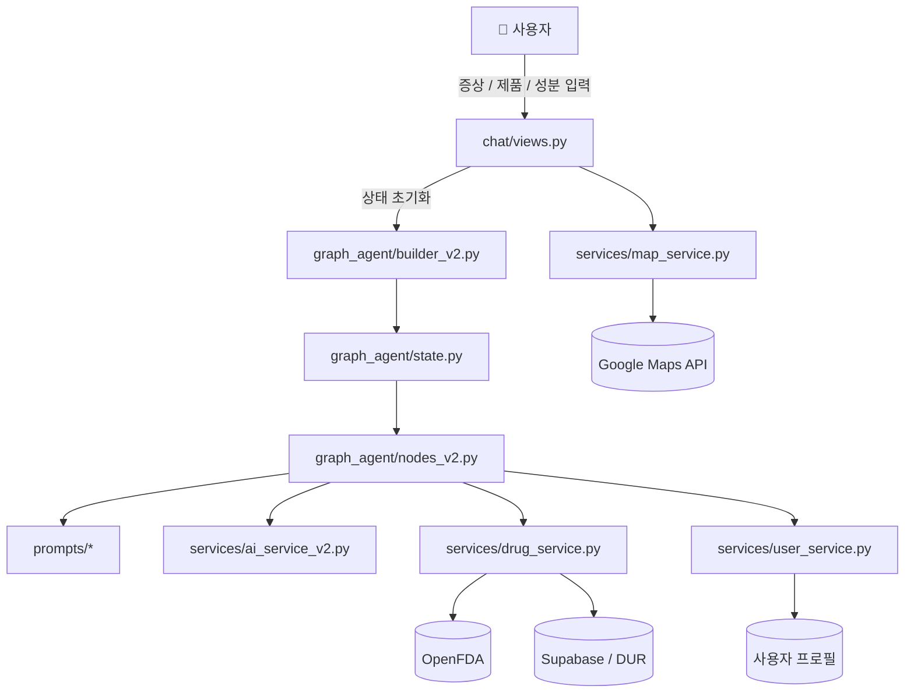
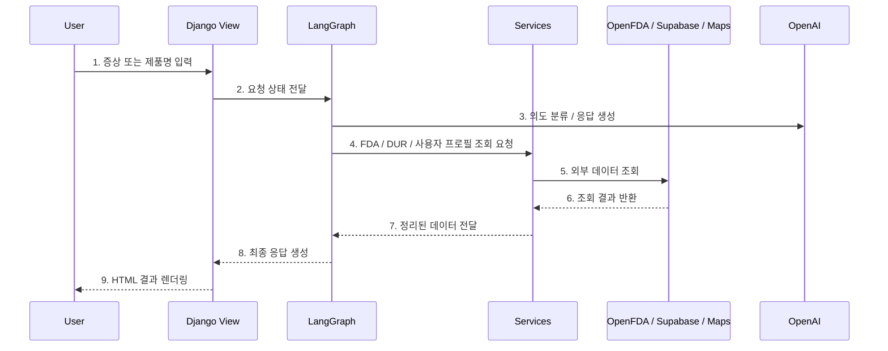
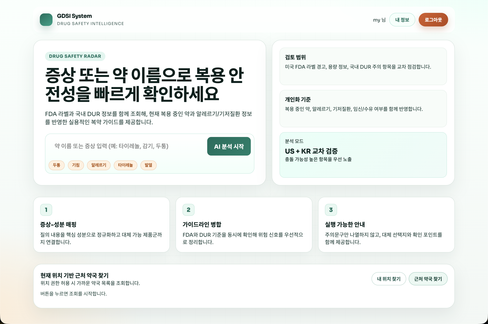
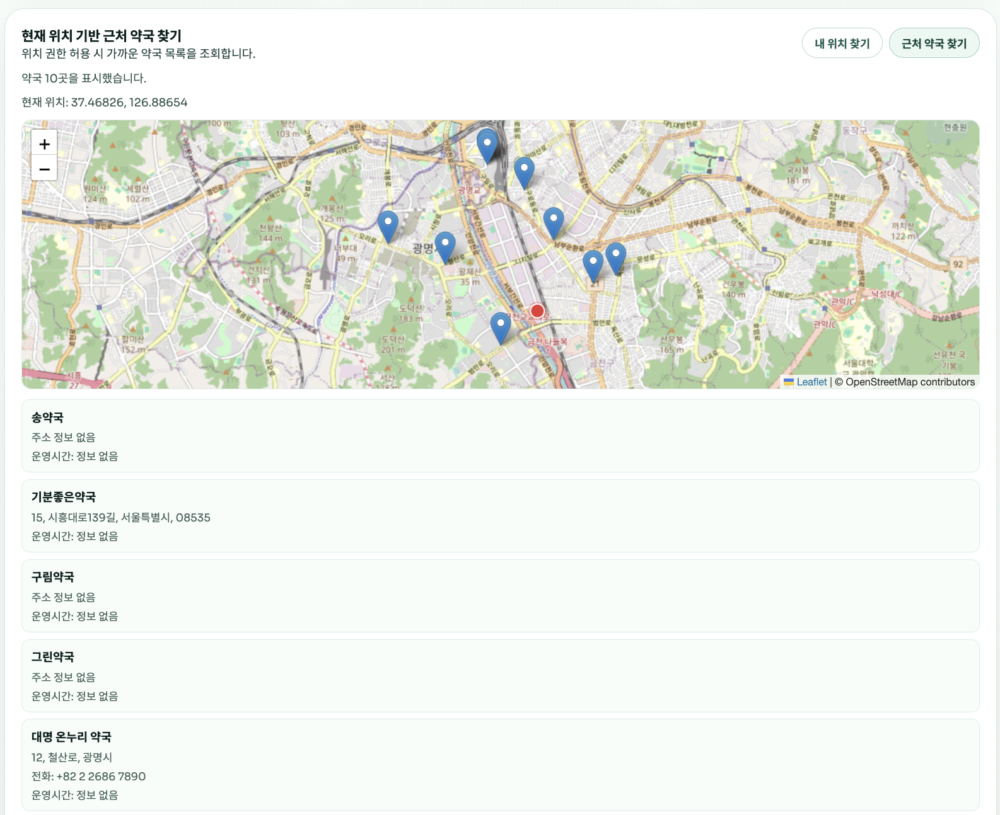

<div align="center">

# 🚑 AI 증상 기반 의약품 정보 서비스

[](https://python.org)
[](https://www.djangoproject.com)
[](https://openai.com)
[](https://www.langchain.com/langgraph)
[](https://supabase.com)

<br/>

**사용자의 증상 메모와 제품/성분 검색 요청을 이해하고, FDA 라벨 정보와 DUR 주의사항을 함께 정리해 주는 스마트 의약품 정보 서비스**

</div>

---

> [!CAUTION]
> **⚠️ 의료 면책 조항 (Medical Disclaimer)**
>
> 본 시스템은 **OpenFDA, 공공데이터포털 DUR, 사용자 프로필 데이터**를 기반으로 정보를 정리하며, **의학적 진단이나 처방을 대체하지 않습니다.**
>
> - 🔴 제공된 정보는 외부 API 응답이나 AI 가공 과정에서 부정확할 수 있습니다.
> - 🔴 모든 건강 관련 결정은 반드시 의사 또는 약사와 상담 후 진행해야 합니다.
> - 🔴 기저질환, 임신 여부, 알레르기, 복용 중인 약물에 따라 결과가 달라질 수 있습니다.
> - 🔴 본 서비스를 사용하며 발생한 직접적·간접적 피해에 대해서 책임지지 않습니다.

---

## 📋 목차

- [기술 스택](#-기술-스택)
- [프로젝트 구조](#-프로젝트-구조)
- [시스템 아키텍처](#-시스템-아키텍처)
- [단계별 상세 설명](#단계별-상세-설명)
- [작동 데모](#-작동-데모)
- [트러블슈팅 및 극복 사례](#-트러블슈팅-및-극복-사례)
- [향후 로드맵](#-향후-로드맵-roadmap)
- [실행 방법](#-실행-방법)
- [질문 예시](#-질문-예시)
- [주요 설정](#-주요-설정)

---

## 🛠 기술 스택

| 분류 | 기술 | 설명 |
|:---:|:---:|:---|
| 🖥️ **Backend & UI** | Django | 메인 웹 애플리케이션, 템플릿 렌더링, 라우팅 |
| 🤖 **Orchestrator** | LangGraph | 상태 기반 질의 분기와 응답 생성 흐름 제어 |
| ✍️ **Agent Core** | OpenAI / GPT 계열 | 의도 분류, 요약, 최종 답변 생성 |
| ☁️ **External API** | OpenFDA | OTC 제품, 성분, 라벨 경고 정보 조회 |
| 🔧 **Data & Auth** | Supabase / MySQL | DUR 데이터 관리, 사용자 데이터, 동기화 저장소 |
| 📡 **External API** | Google Maps API | 주변 약국/병원 조회 및 위치 기반 탐색 |

---

## 📁 프로젝트 구조

```text
drug_info/
├── otc_info/                         # Django 메인 애플리케이션
│   ├── chat/                         # 웹 진입점과 화면 흐름
│   ├── drug/                         # 의약품 관련 모델과 뷰
│   ├── graph_agent/                  # LangGraph 노드, 상태, 빌더
│   │   ├── builder_v2.py             # 그래프 라우팅 및 컴파일
│   │   ├── nodes_v2.py               # 단계별 처리 노드
│   │   └── state.py                  # 공용 상태 정의
│   ├── otc_info/                     # Django settings / urls / asgi / wsgi
│   ├── prompts/                      # 시스템/응답 프롬프트
│   ├── services/                     # FDA, DUR, 지도, AI, 사용자 서비스
│   ├── templates/                    # 메인/검색/결과 템플릿
│   ├── manage.py
│   └── run_uvicorn.py                # ASGI 실행 스크립트
├── data_pipeline/                    # 데이터 수집/가공/동기화 스크립트
├── 01_requirements_spec/             # 요구사항 문서
├── 02_ui_wireframe/                  # 와이어프레임
├── 03_system_architecture/           # 설계 문서
├── 04_test_plan_results/             # 테스트 결과 문서
├── Dockerfile
├── requirements.txt
├── main.png
└── map.png
```

---

## 🔄 시스템 아키텍처

본 프로젝트는 **Django + LangGraph + 서비스 계층** 구조를 사용합니다. 웹 요청은 `chat/views.py`에서 진입하고, LangGraph가 질의 유형에 따라 적절한 노드를 거치도록 분기하며, 실제 FDA/DUR/지도 조회는 `services/` 계층이 담당합니다.



### 🌊 출력 파이프라인 (Data Pipeline Flow)

사용자가 증상 또는 제품명을 입력하면, 시스템은 먼저 질문 의도를 분류하고 필요한 외부 데이터를 수집한 뒤 최종 응답을 만듭니다.



### 🧩 주요 모듈 상세 설명

- **애플리케이션 계층 (`otc_info/chat/views.py`)**
  사용자 요청을 받고, LangGraph 흐름과 HTML 렌더링을 연결합니다.

- **상태 머신 계층 (`otc_info/graph_agent/`)**
  질의 유형에 따라 어떤 노드를 거칠지 결정하고, 노드 간 공유 상태를 관리합니다.

- **서비스 계층 (`otc_info/services/`)**
  OpenFDA, DUR, 지도, 사용자 프로필, AI 호출을 실제로 수행합니다.

- **프롬프트 계층 (`otc_info/prompts/`)**
  질의 분류와 응답 생성에 필요한 시스템 프롬프트와 출력 형식을 관리합니다.

---

## 단계별 상세 설명

### Phase 1: Classifier (Router Node)

- **파일**: `otc_info/graph_agent/nodes_v2.py`
- **역할**:
  - 사용자의 입력을 증상 정리, 제품/성분 확인, 일반 질의 등의 흐름으로 분기합니다.
  - 잘못된 형식의 입력이나 후속 정보가 필요한 요청을 조기에 걸러냅니다.

### Phase 2: User Context Integration

- **파일**: `otc_info/services/user_service.py`
- **역할**:
  - 로그인 사용자의 프로필, 복용약, 알레르기, 건강 상태를 불러옵니다.
  - DUR 확인 시 사용자별 주의사항을 반영할 수 있게 상태에 주입합니다.

### Phase 3: Data Retrieval (API Search)

- **파일**: `otc_info/services/drug_service.py`, `otc_info/services/supabase_service.py`
- **역할**:
  - OpenFDA에서 제품/성분/라벨 정보를 조회합니다.
  - Supabase에 적재된 DUR 데이터와 매핑해 주의사항을 수집합니다.

### Phase 4: Generator & Action (Synthesis / Map)

- **파일**: `otc_info/services/ai_service_v2.py`, `otc_info/services/map_service.py`
- **역할**:
  - 조회된 데이터와 프롬프트를 바탕으로 최종 답변을 생성합니다.
  - 필요할 경우 주변 약국/병원 정보를 함께 안내합니다.

---

## Router(Graph) Pattern의 장점

1. **질문 유형별 분기 최적화**
   제품 확인 질문과 증상 메모 질문을 서로 다른 흐름으로 처리할 수 있습니다.

2. **안전 정보 강제 결합**
   단순 LLM 응답이 아니라 FDA / DUR / 프로필 정보를 결합해 안전 관련 확인 단계를 강제할 수 있습니다.

3. **서비스 분리**
   외부 API 호출, 사용자 정보, 지도 탐색, 응답 생성이 분리되어 유지보수가 쉽습니다.

---

## 📸 작동 데모

| 🌐 메인 화면 | 🗺️ 주변 약국 조회 |
|:---:|:---:|
|  |  |
| **증상 메모 / 제품 검색 진입 화면** | **위치 기반 주변 약국/병원 탐색** |

---

## 🛠 트러블슈팅 및 극복 사례

### 1. LangGraph Pipeline 환각(Hallucination) 제어

- **문제**: 증상만으로 과도한 추천이나 불필요한 답변이 생성될 수 있었습니다.
- **해결**: 질의 분류와 FDA/DUR 조회를 분리하고, 응답 생성 전에 안전성 관련 데이터를 결합하는 구조로 정리했습니다.

### 2. 응답 생성 지연 문제

- **문제**: 외부 API 호출이 많아질수록 페이지 응답이 느려졌습니다.
- **해결**: 서비스 계층을 분리하고, 필요한 질의만 수행하도록 흐름을 정리해 병목을 줄였습니다.

### 3. Django 비동기(ASGI) 실행 정리

- **문제**: 개발 서버 실행 방식과 실제 서비스 호출 구조가 일관되지 않았습니다.
- **해결**: `run_uvicorn.py`를 기준으로 ASGI 실행 경로를 명확히 정리했습니다.

### 4. 구조 변경 이후 문서와 실제 코드 불일치

- **문제**: 예전 `skn22_4th_prj/` 구조를 기준으로 문서가 남아 있었습니다.
- **해결**: 현재 `otc_info/` 구조 기준으로 경로와 실행 방법을 다시 맞췄습니다.

---

## 🚀 향후 로드맵 (Roadmap)

- [ ] 증상 메모와 제품 확인 흐름을 더 명확히 분리한 UX 개선
- [ ] FDA 라벨 요약 정확도 개선과 캐시 전략 정비
- [ ] 지도 검색 결과와 제품 확인 흐름의 연결 강화
- [ ] 사용자 프로필 기반 DUR 경고 정교화

---

## 🚀 실행 방법

### 1️⃣ 필수 패키지 설치

```bash
python -m venv .venv

# Windows PowerShell
.venv\Scripts\Activate.ps1

pip install -r requirements.txt
```

### 2️⃣ 환경 변수 설정

프로젝트 루트에 `.env` 파일을 생성하고 아래 값을 채웁니다.

```env
# OpenAI
OPENAI_API_KEY=

# Supabase
SUPABASE_URL=
SUPABASE_KEY=

# Database
DB_HOST=
DB_NAME=
DB_USER=
DB_PASSWORD=

# Maps
GOOGLE_MAPS_API_KEY=
```

### 3️⃣ 애플리케이션 (Django) 마이그레이션 및 서버 구동

```bash
cd otc_info
python manage.py migrate
python run_uvicorn.py
```

---

## 💬 질문 예시

| 카테고리 | 질문 예시 | 비고 |
|:---:|:---|:---|
| **제품명/성분** | "타이레놀 성분이 뭐야?" | 제품/성분 확인 흐름 |
| **증상 메모** | "머리가 아프고 열이 나요" | 증상 메모 정리 흐름 |
| **일반 질의** | "이 약은 어떤 용도야?" | 라벨 기반 일반 정보 정리 |

---

## ⚙️ 주요 설정

- `otc_info/graph_agent/builder_v2.py`
  LangGraph 라우팅과 노드 연결 방식을 정의합니다.

- `otc_info/services/ai_service_v2.py`
  분류와 응답 생성에 사용하는 AI 호출 로직이 들어 있습니다.

- `otc_info/services/drug_service.py`
  제품/성분/FDA 조회와 안전 정보 정리의 핵심 서비스입니다.

- `otc_info/otc_info/settings.py`
  Django 앱 등록, 템플릿, DB, 환경 변수 설정이 모여 있습니다.

---

<div align="center">
  <sub>Built with Django, LangGraph, OpenAI, and Supabase</sub>
</div>
