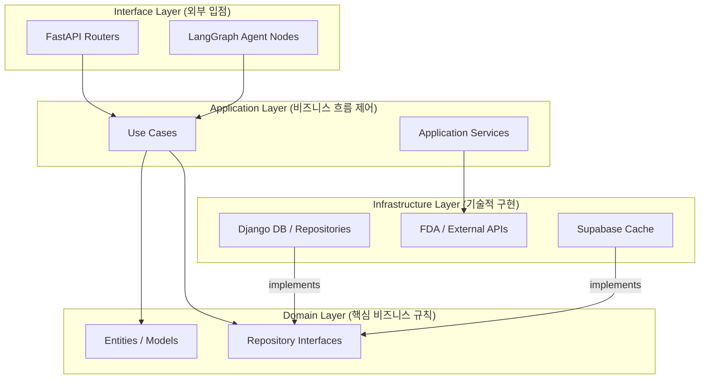

# DDD(Domain-Driven Design) 아키텍처 가이드

본 프로젝트는 코드의 유지보수성, 확장성, 그리고 테스트 용이성을 극대화하기 위해 **DDD(Domain-Driven Design)** 패턴을 기반으로 아키텍처를 재설계했습니다. 각 계층은 명확한 책임(Responsibility)을 가지며, 의존성은 외부에서 내부로만 흐르도록 설계되었습니다.

---

## 1. 계층 구조 및 역할 (Layered Architecture)

### 📂 인터페이스 계층 (Interface Layer)
- **위치**: `api_fastapi/interfaces/`
- **역할**: 외부 시스템(웹 브라우저, 에이전트 등)에서 들어오는 요청을 받고 응답을 반환합니다.
- **주요 파일**:
  - `api/routers/`: HTTP 엔드포인트 정의 (예: 인증, 검색, 약 정보).
  - `agent/nodes_v2.py`: AI 에이전트의 각 단계(Node) 로직 정의.

### 📂 애플리케이션 계층 (Application Layer)
- **위치**: `api_fastapi/application/`
- **역할**: 도메인 객체와 인프라 서비스를 조합하여 실제 비즈니스 시나리오(유스케이스)를 완성합니다.
- **주요 파일**:
  - `use_cases/symptom_recommend.py`: 증상 기반 약 추천 핵심 시나리오.
  - `services/ai_service.py`: AI 모델(OpenAI) 호출 및 프롬프트 제어.
  - `services/map_service.py`: 미국 제품 검색 및 번역 조율.

### 📂 도메인 계층 (Domain Layer)
- **위치**: `api_fastapi/domain/`
- **역할**: 가장 내핵에 해당하며, 비즈니스의 본질적인 규칙과 데이터 모델을 정의합니다. **외부 기술(DB 종류, API 등)에 의존하지 않습니다.**
- **주요 파일**:
  - `drug/repositories.py`: 약 및 DUR 정보 조회를 위한 추상 인터페이스 정의.
  - `drug/models.py`: 도메인 엔티티 정의.

### 📂 인프라 계층 (Infrastructure Layer)
- **위치**: `api_fastapi/infrastructure/`
- **역할**: 도메인에서 정의한 인터페이스를 기술적으로 구현합니다 (DB, API, 파일 등).
- **주요 파일**:
  - `django_db/`: 기존 Django ORM을 활용한 리포지토리 구현체.
  - `external_api/fda_client.py`: 미국 FDA Open API 통신 클라이언트.
  - `cache/supabase_cache.py`: 빠른 응답을 위한 Supabase 기반 캐싱 구현.

---

## 2. 주요 설계 포인트

### ⚙️ 의존성 역전 (Dependency Inversion)
애플리케이션 계층은 특정 DB 라이브러리가 아닌 `domain/repositories.py`에 정의된 추상 인터페이스에만 의존합니다. 이로 인해 DB를 PostgreSQL에서 다른 시스템으로 바꾸더라도 비즈니스 로직(Use Case)은 전혀 수정할 필요가 없습니다.

### 🚀 캐싱 및 성능 최적화 (v5 고도화)
- **스마트 캐시**: `nodes_v2.py`에서 캐시 데이터를 조회할 때 버전을 체크하여, 아키텍처나 프롬프트 변경 시 자동으로 갱신되도록 설계되었습니다.
- **벌크 번역**: 개별 성분마다 AI를 호출하던 비효율을 개선하여, 인프라 계층에서 데이터를 모아 애플리케이션 서비스에서 한 번에 벌크 처리함으로써 응답 속도를 3~5배 향상했습니다.

### 🤖 에이전트 워크플로우 (LangGraph)
AI 에이전트 로직을 하드코딩하지 않고 각 단계를 노드로 나누어 관리(`interfaces/agent/nodes_v2.py`)함으로써 복잡한 추천 프로세스를 시각적으로 관리하고 유연하게 변경할 수 있습니다.
